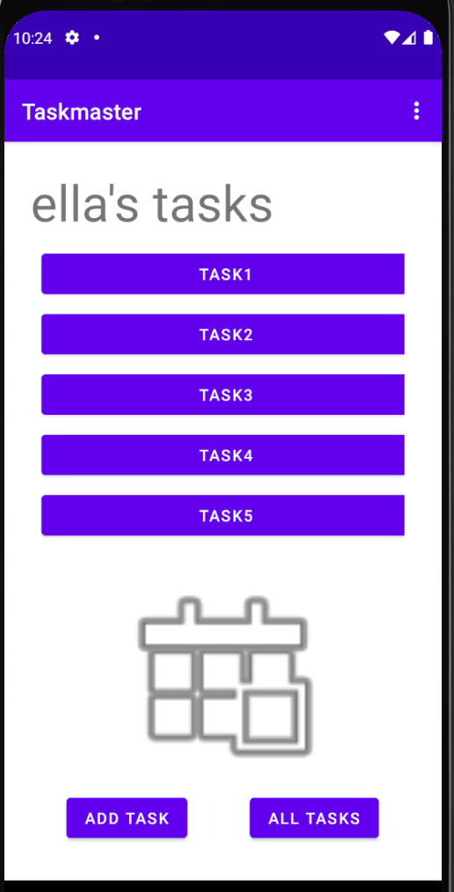

# taskmaster

Taskmaster is an application used to track you todos and help enable/ motivate you to get them done!

## recent changes

v 0.1
* Adds the landing screen with links to Add Task and All tasks.
* Adds create new task page with a submit button that increments task count.
* Adds all Tasks page that is a place holder for future content.

v 0.2
* Adds settings screen and menu dropdown.
* Adds task detail page with 4 static tasks on the homepage.

v 0.3
* Adds tasks to the front page within a RecyclerView
* Lays out groundwork to store tasks within an abstract class and easily update them

v 0.4
* Adds the ability to dynamically create and save tasks into the Db.
* Task details now loads the entire task rather than just the task title being passed in.
* adds ability to save tasks into the DB and basic dao commands:
  * getAll
  * getCount
  * getById
  * insert

v 0.5
* backend update only: Now using Amplify to store data on remote server as compared to the local phone.

v 0.6
* adds the concept of teams
* user can set a team for themselves
* able to create tasks for different teams
* user only seas tasks on the hom screen assigned to themselves.

v1.0
* published the initial application to Android
* pushed apk to play store console.
  * version numbers have been incremented within the build file.

